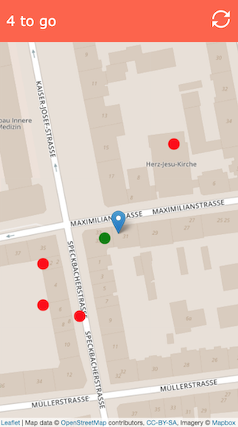

# Geolocation Game
## Take a gamified PWA stroll in the park

- find 5 random places near your location
- get within 10 meters of a place to mark it green
- use the refresh button to restart in case of unreachable places
- use the refresh button to start a new game
- tab/click on a place to show its distance to your location
- works offline using PWA technologies
- uses leaflet.js

## Demo
Hosted on Github https://tmaurhart.github.io/leafletpt/

## Screenshot

